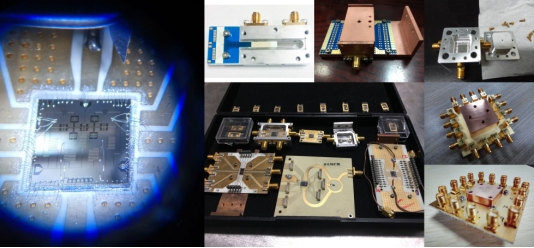
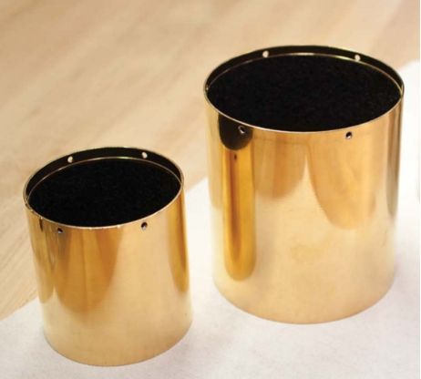

3.2 量子计算机硬件
==================================
  由上一章节知道，量子计算机的核心——量子芯片，具有多种不同的呈现形式。绝大多数量子芯片，名副其实地，是一块芯片，由集成在基片表面的电路结构构建出包含各类量子比特的量子电路。但量子芯片不等同于量子计算机，它仅仅是量子计算机中的一个核心结构。

  量子计算机，是建立在量子芯片基础上的运算机器。其中最关键的两点是：如何将运算任务转化为对量子芯片中量子比特的控制指令；以及如何从量子芯片上量子比特的量子态中提取出运算结果。除此以外，更加基础地，量子计算机需要提供能维持量子芯片运行的基本环境。以上这些都需要特殊的硬件系统来实现，它们实现了量子计算机软件层到量子计算机芯片层的交互。

  量子计算机硬件，主要包含两个部分，一个是量子芯片支持系统，用于提供量子芯片所必需的运行环境；另一个是量子计算机控制系统，用于实现对量子芯片的控制，以完成运算过程并获得运算结果。鉴于目前国际主流量子计算研发团队主要聚焦超导量子芯片与半导体量子芯片这两种体系，同时它们的量子计算机硬件有相当多的共性，因此以下将具体展开介绍这两种体系适用的量子计算机硬件。

3.2.1 量子芯片支持系统
----------------------------------
  超导量子芯片和半导体量子芯片对运行环境的需求类似，最基本的需求均为接近绝对零度的极低温环境。其主要原因在于两种体系的量子比特的能级接近，基本上都在GHz频段。该频段内的热噪声对应的噪声温度约在300 mK以上。为了抑制环境噪声，必须使量子芯片工作在远低于其能级对应的热噪声温度。稀释制冷机能够提供量子芯片所需的工作温度和环境。利用3He/4He混合气实现稀释致冷，稀释制冷机能够将量子芯片冷却到10 mK以下的极低温。在2018年IBM's inaugural Index 开发者大会上，IBM展示的“50位量子计算机原型机”，实际上就是维持50位量子芯片运行的稀释制冷机以及其内部的线路构造。

.. image:: ./images/wps499.png
   :align: center
.. centered:: 图3.2.1 IBM的稀释制冷机，用于容纳50位量子芯片

  图3.2.1展示了IBM的稀释制冷机。除了稀释制冷机本身以外，量子计算研究人员需要花费大量精力设计、改造、优化稀释制冷机内部的控制线路与屏蔽装置，以全面地抑制可能造成量子芯片性能下降的噪声因素。其中最主要的三点是热噪声、环境电磁辐射噪声以及控制线路带来的噪声。

  抑制热噪声的主要方式，是在稀释制冷机的基础上，为量子芯片设计能迅速带走热量的热沉装置，该装置需要兼容量子芯片的封装。图3.2.2是包含多种热沉结构的量子芯片封装照片，包含半导体量子芯片以及超导量子芯片，其中热沉主要使用了无氧紫铜材料。

.. centered:: 图3.2.2 量子芯片的热沉与封装[45]

  环境电磁辐射噪声是较难控制的环境干扰，其中又可以分为电场辐射以及磁场辐射。电场辐射主要产生来源是稀释制冷机中更高温层的红外辐射，其频段和量子比特的能级相仿，因此会加速量子比特的弛豫过程，从而降低量子芯片的性能。磁场辐射来源复杂，诸如地磁场、带磁元件的剩磁、控制电流引发的磁场等，它们会干扰量子比特的能级，破坏量子芯片的相干时间。可工作于极低温环境的电磁屏蔽技术，一直是伴着量子计算研究人员的需求发展的。图3.2.3展示了伯克利大学Sidiqqi研究组使用的一种红外辐射屏蔽技术。他们设计了用于包裹量子芯片的屏蔽桶，并在桶的内壁使用了一种黑色的特殊涂层，用于增强对红外辐射的吸收。

.. centered:: 图3.2.3 红外辐射屏蔽装置

  控制线路携带的噪声，主要也是由热效应引起的。由于量子芯片工作环境的特殊性，从量子计算机控制系统发出的控制信号，要从稀释制冷机接入，经过漫长的低温线路，最后到达量子芯片。而热噪声近似和温度成正比，可想而知，从室温（约300 K）传入的噪声，相比前面所说的量子比特能级对应的噪声温度（月300 mK）相差了近1000倍。这么大的噪声如果直接到达维持在10 mK温度的量子芯片，则会直接破坏量子比特的量子相干性。解决办法是尽可能地抑制从室温传入的信号，使从室温传入的噪声降至和量子芯片的工作温度一个级别。同时，我们还要设法将除了控制信号以外的其他所有频段的无关信号一并滤除，而这，则是通过各类特种低温滤波器实现的。图3.2.4是适用于超导量子芯片的量子芯片支持系统中极低温控制线路的设置。

.. image:: ./images/3.2.4.png
   :align: center
.. centered:: 图 3.2.4 量子芯片支持系统中极低温控制线路的设置[46] （Flux offset source-磁通偏置源，Flux pulse source-磁通脉冲源，Qubit drive source-量子比特驱动源，Readout source-测量源，Readout detection-测量探测RC filter-RC滤波器，Cu powder-铜粉滤波器，LPF-低通滤波器，Bias-tee-一种电阻器件，XY-control-XY控制线，Z-control-Z控制线，Readout in-测量输入，Readout out-测量输出，Circulator-环形器，J-Amp-约瑟夫森量子参量放大器，HEMT-高电子迁移率放大器，Package-封装，Shield-屏蔽，Superconducting quantum chip-超导量子芯片）

3.2.2 量子计算机控制系统
----------------------------------
  量子计算机控制系统提供的是以下两个关键问题的解决方案：如何将运算任务转化为对量子芯片中量子比特的控制指令；以及如何从量子芯片上量子比特的量子态中提取出运算结果。其背后的基础是，如何实施量子逻辑门操作，以及如何实施量子比特读取。

.. image:: ./images/3.2.5.png
   :align: center
.. centered:: 图3.2.5 量子计算机控制系统工作原理

  量子逻辑门操作的本质是使一组量子比特经过指定的受控量子演化过程。例如，使得量子比特从基态（或者称 :math:`|0 \rangle` 态）到激发态（或者称 :math:`|1 \rangle` 态），可以借助一个单量子比特π门来实现。实施这样的受控量子演化过程，需要借助精密的脉冲信号，通常可以使用高速任意波形发生器、商用微波源、混频线路等的组合来实现。当然，通过对光场、磁场甚至机械声波的调控，也可以在某些量子芯片体系中实现量子逻辑门操作。商用设备的性能越高，越容易实现高保真度的量子逻辑门操作，当然，前提是量子比特的质量可靠。图3.2.6显示了商用仪器的相噪指标对操作保真度的影响。

.. image:: ./images/3.2.6.png
   :align: center
.. centered:: 图3.2.6 微波源相位噪声对操作保真度的影响[47]

  量子态的读取有多种方式，但考虑到需要读取量子芯片中某个或者某组量子比特的量子态，必须要使用一种称之为非破坏性测量的方式，以消除因测量导致的反作用。通常的方法是在量子比特结构旁边额外设计一个对量子态敏感的探测器，间接地通过探测探测器的响应来推测量子比特的量子态。图3.2.7是一个半导体量子芯片以及其探测器结构，该探测器为一个RF探测器，通过该探测器的指定频率的微波信号会随着半导体量子芯片中电子状态变化，进而能从RF探测器的信号中计算出量子比特的量子态变化。捕获RF探测器的信号的装置通常为网络分析仪或者高速数字采集卡。

.. image:: ./images/3.2.7.png
   :align: center
.. centered:: 图3.2.7 半导体量子芯片以及RF探测器（QPC-量子点接触，量子比特的电学测量通道，Nb-铌，Sapphire-蓝宝石，Bias-tee-一种名为bias-tee的电学器件，L/LP/C/RP/R/N-图中各个电极的编号，不需要翻译，Dc-直流，L-电感，Cp-下标为p的电容）

  随着量子芯片集成度的提高，纯粹采用商用仪器搭建量子芯片的控制与读取系统的方法的弊端越来越大。商用仪器成本昂贵，功能冗余，兼容性差，难以集成，并不满足未来量子计算机的发展需要。为量子计算机专门设计并研制适用的量子计算机控制系统，是明智的选择。目前，量子计算机控制系统的研究刚刚起步不久。2016年，苏黎世仪器公司与代尔夫特理工大学研究团队成立的QuTech公司合作，研制了一套可用于7位超导量子芯片工作的集成量子芯片测控系统，包含最高可扩展至64通道的AWG以及同步的高速ADC采集通道。2017年底，是德科技自主研发了一套100通道的量子芯片测控系统，具备百ps级系统同步性能与百ns级量子芯片信号实时处理能力，最高可用于20位超导量子芯片完整运行。2018年，合肥本源量子计算科技有限责任公司也研制出40通道的量子芯片测控系统，可以应用于8位超导量子芯片或者2位半导体量子芯片，这是国内第一套完整的量子计算机控制系统。除此之外，加州大学-圣塔芭芭拉分校、苏黎世理工学院、中国科学技术大学合肥微尺度物质科学国家实验室、Raytheon BBN Technologies公司等都有自主研发的量子计算机控制系统或者模块。为了降低功耗，提高信号质量，代尔夫特理工大学和悉尼大学的研究团队开展了4K到100mK温度的极低温量子计算机控制系统的研究。

.. image:: ./images/wps508.jpg
   :align: center
.. centered:: 图3.2.8 本源量子研制的量子计算机控制系统 

.. image:: ./images/3.2.9.png
   :align: center
.. centered:: 图3.2.9 极低温量子计算机控制系统设计概念图[48]（Prime waveform-模拟信号波形，Readout carrier-读取载波，Digital-数字信号，Dc-直流，Waveform generator-波形发生器，Prime-line bus-模拟信号总线，Address-line bus-地址信号总线，ADC-模数转换器，Amplifier-放大器，Coupler-耦合器，Multiplexing-混合器，Switch matrix-开关阵列，Qubits-量子比特，Pulsing-实施脉冲，Biasing-实施偏置，Multi-channel DAC-多通道数模转换器，Dilution fridgerator-稀释制冷机，Programming-编程，300K/4K/20mK-开尔文制温度，Clock-时钟信号，Logic-逻辑处理器）

