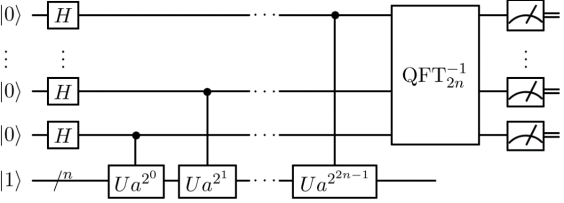

4.7 Shor分解算法
==================================

  Shor算法，又叫质因数分解算法，是以数学家Peter·Shor命名的。1994年，Shor针对“给定一个整数 :math:`N` ，找出它的质因数”这道题，发明了破解RSA加密的量子算法。在一个量子计算机上面，要分解整数 :math:`N` ，Shor算法的运作需要多项式时间（时间是 :math:`\log N` 的某个多项式这么长， :math:`\log N` 在这里的意义是输入的文件长度）。更精确的说，这个算法花费 :math:`\mathrm{O}((\log N)^3)` 的时间，展示出质因数分解问题可以使用量子计算机以多项式时间解出，因此在复杂度类BQP里面。这比起传统已知最快的因数分解算法:普通数域筛选法，其花费次指数时间 -- 大约 :math:`\mathrm{O}\left(e^{1.92(\log N)^{1 / 3}(\log \log N) ^{2 / 3}}\right)` ，还要快了一个指数的差异。

4.7.1 加密与解密
----------------------------------
  自古以来，加密和解密都伴随着人类的发展。中国军事谋略中也常听到知己知彼，百战不殆的说法；在军事上，信息的安全保密被认为是取得胜利的关键因素；在生活中，也经常可以看到使用智慧找到解开密码的方法（方法就是密码学里的密钥），从而解开那些千奇百怪的密文。

  密码学，主要分为古典密码学和现代密码学。对于计算机时代，主要讨论现代加密方式，就是基于二进制编码信息的现代密码学。

**对称加密（symmetric encryption）**

  采用单钥密码系统的加密方法，同一个密钥可以同时用作信息的加密和解密，这种加密方法称为对称加密，也称为单钥加密。通俗的说，就是将明文（原本的信息）通过某种方式打乱，使得加密后的信息与原文不相同，但是这种打乱方式有一定的规律，使用密钥进行加密。

  所谓对称，就是采用这种加密方法的双方使用方式用同样的密钥进行加密和解密。密钥是控制加密及解密过程的指令；算法是一组规则，规定如何进行加密和解密。

  例如：Alice要给Bob发一段信息，需要用密钥给信息加密，而Bob接收信息时候需要利用相同的密钥，才可以解密信息。如图4.7.1：

.. image:: ./images/4.7.1.png
   :align: center
.. centered:: 图4.7.1 对称加密

**非对称加密（Asymmetric encryptio）**

  非对称加密算法需要两个密钥来进行加密和解密，这两个密钥是公开密钥（public key，简称公钥）和私有密钥（private key，简称私钥）。公开密钥与私有密钥是一对，如果用公开密钥对数据进行加密，只有用对应的私有密钥才能解密；如果用私有密钥对数据进行加密，那么只有用对应的公开密钥才能解密。如图4.7.2所示：

.. image:: ./images/4.7.2.png
   :align: center
.. centered:: 图4.7.2 非对称加密

4.7.2 RSA加密算法
----------------------------------
  RSA加密算法是1977年由罗纳德·李维斯特（Ron Rivest）、阿迪·萨莫尔（Adi Shamir）和伦纳德·阿德曼（Leonard Adleman）一起提出的。该算法是著名的非对称加密算法，它是数论与计算机科学相结合产物。目前，很多加密方式都采用这个原理，而Shor算法所威胁的正是RSA的加密方式.

  RSA是Internet上的标准加密算法。该方法是公知的，但非常难以破解。其核心是它使用两个密钥进行加密，公钥是公开的，客户端使用它来加密随机会话密钥；截获加密密钥的任何人都必须使用第二个密钥（私钥）对其进行解密；否则，得到的信息是没有任何含义。而会话密钥解密后，服务器使用它以更快的算法加密和解密更多消息。因此，只要保证私钥安全，通信就是安全的。

  实际上，RSA算法，其核心的思想并不困难，它使用的是，两个质数相乘容易，但是反过来分解成两个质数相乘却非常困难的规则来构建。

.. image:: ./images/4.7.3.png
   :align: center
.. centered:: 图4.7.3 数字相乘与数字分解

  例如图4.7.3，求这串数字相乘，对于经典计算机来说，非常的简单。但是如果将这串数字分解为两个质数相乘，就非常困难。

**RSA算法规则**

  首先要使用概率算法来验证随机产生的大的整数是否是质数，这样的算法比较快而且可以消除掉大多数非质数。假如有一个数通过了这个测试的话，那么要使用一个精确的测试来保证它的确是一个质数。

  首先，生成两个大的质数  :math:`\mathrm{p}` 和  :math:`\mathrm{q}` ; 然后计算  :math:`\mathrm{n}=\mathrm{p} \times \mathrm{q}` ， 以及  :math:`\varphi=(p-1) \times(q-1)` ; 再选择一个随机数 :math:`1<e<\varphi` , 那么， :math:`\text{gcd}(e, \varphi)=1` ; 最后计算唯一的整数  :math:`1<d<\varphi` , 那么: :math:`e \times d=1(\bmod \varphi)` ; 就可以生成  :math:`(d, n)` 是私钥;  :math:`(e, n)`是公钥。 进行加密，将讯息 :math:`m` 用区间  :math:`[0, n-1]` 的整数来表示; 通过加密得到数据 :math:`c` ，然后发送 :math:`c`。

.. math::
    c=m^{e} \bmod n 

  那么，解密钥则是:

.. math::
    m=c^{d} \bmod n

**GCD算法**

  两个整数的最大公约数等于其中较小的那个数和两数相除余数的最大公约数；最大公约数缩写为GCD；GCD算法是最大公约数算法的简称；例如 :math:`\text{gcd}(\mathrm{N}{1}, \mathrm{~N}{2})` ，就是求  :math:`\mathrm{N}{1}, \mathrm{~N}{2}` 的最大公因数算法，如果  :math:`\text{gcd}(\mathrm{N}{1}, \mathrm{~N}{2})=1` ，则称  :math:`\mathrm{N}{1}, \mathrm{~N}{2}` 互质。

  例，求  :math:`\text{gcd}(12, 24)` ?

  答: 数字 24 可以表示为几组不同正整数的乘积:

.. math::
    24=1 \times 24=2 \times 12=3 \times 8=4 \times 6 

  所以，24 的正因数为: 1,2,3,4,6,8,12,24 。 

  数字 12 可以表示为几组不同正整数的乘积:

.. math::
    12=1 \times 12=2 \times 6=3 \times 4

  所以， 12 的正因素为 1 ， 2 ， 3 ， 4 ， 6 ， 12 。 

  两组数中共同的元素，就是它们的公因数：1，2，3，4，6，12；其中的最大公因数是 12 ，即  :math:`\text{gcd}(12, 24)=12` 。

**Mod运算符**

  Mod 运算，是求模运算符（即求余运算），是在整数运算中求一个整数  :math:`\mathrm{x}` 除以另一 个整数  :math:`\mathrm{y}` 的余数的运算，且不考虑运算的商。例如  :math:`a \bmod b=c` ，表明  :math:`{a}` 除以  :math:`{b}` 余数为  :math:`{c}` 。 如下所示:

.. math::
    \begin{aligned} 1 \bmod 12 &=1 \\ 4 \bmod 12 &=4 \\ 20 \bmod 12 &=8 \\ 25 \bmod 12 &=1 \end{aligned}

  模运算满足条件:

.. math::
    a b \bmod N=[(\text{amod} N) \times(b \bmod N)] \bmod N 

例: 求  :math:`5^{3} \bmod 11` ?   答:

.. math::
    \begin{aligned} & 5^{3} \bmod 11 \\ =& 5^{2} \times 5 \bmod 11 \\ =& 25 \times 5 \bmod 11 \\ =& 3 \times 5 \bmod 11 \\ =& 15 \bmod 11=4 \end{aligned} 

  那么，由此推导得出的公式为

.. math::
    f(r)=a^{r} \bmod N 

**RSA加密原理**

.. image:: ./images/4.7.4.png
   :align: center
.. centered:: 图4.7.4 RSA加密原理

  RSA加密原理，就是发送方把信息进行RSA加密算法的运算，得到加密的信息进行传输，传输完成，接收方收到的加密信息需要进行解密算法的运算，才可以得出原始传输数据信息。讯息，也是明文。比如文本，有效数据之类的信息。

  例：假设A=65，B=66，…，Z=90，…；怎样可以安全的把BY这个信息从上海带回合肥？

.. image:: ./images/4.7.5.png
   :align: center
.. centered:: 图4.7.5 例题图

  答: 由上述信息可知，运用 RSA算法，明文 BY 对应的字符串 T 是： 66,89 ；再构 造公钥和私么钥: 选取  :math:`p=103` , :math:`q=97` ；那么，得出公钥为  :math:`(e, n)=(1213, 9991)` , 私钥为 :math:`(d, n)=(4117, 9991)` 。 由  :math:`\mathrm{RSA}` 加宓公式 :math:`c=m^{e} \bmod n` ;可得:

.. math::
    \begin{array}{l} C_{1}=66^{1213} \bmod 9991=8151 \\ C_{2}=89^{1213} \bmod 9991=176 \end{array} 

  所以，最终荧回合肥的信息为 :math:`8151` ， :math:`176` 。 

  那么，最终带回合肥的信息如何解密呢? 

  由上述的可知，私钥为  :math:`(d, n)=(4117, 9991)` ; 再进行 RSA 解密运算  :math:`m=c^{d} \bmod n` ； 可得

.. math::
    \begin{aligned} m_{1} &=8151^{4117} \bmod 9991=66 \\ m_{2} &=176^{4117} \bmod 9991=89 \end{aligned}

  再由题中的已知条件，就可以恢复明文为 BY。

**Shor算法破解RSA加密问题**

  在一个量子计算机上面，要分解整数  :math:`\mathrm{N}` ， Shor 算法的运作需要多项式时间 ( 时间是  :math:`\log \mathrm{N}` 的某个多项式这么长，  :math:`\log \mathrm{N}` 在这里的意义是输入的档案长度 ) ; 更精确的说，这个算法花费  :math:`\mathrm{O}((\log \mathrm{N}))` 的时间，展示出质因数分解问题可以使用量子计算机以多项式时间解 出，因此在复杂度类  :math:`\mathrm{BQP}` 里面，Shor 算法比起传统已知最快的因数分解算法、普通数域筛选法还要快了一个指数的差异。

  参考图4.7.6的线路图，量子部分，主要帮助寻找到周期：

.. centered:: 图4.7.6 线路图

  Shor算法可以分为经典部分和量子部分，通过两个部分的相互结合，从而到到分解的目的。经典部分，主要是在传统计算机上进行运行，目前不存在已知的算法可以对RSA带来威胁；但是量子部分是需要用量子系统来处理，量子计算对RSA提供了解决方案。

\ **shor算法运算流程：** \

    1. 随机选择任意数字 :math:`1<a<N` ；

    2. 计算 :math:`\text{gcd}(a, N)`。使用经典算法完成；

    3. 如果  :math:`\text{gcd}{(a}, N) \neq 1` 则返回到第一步；

    4. 当 :math:`\text{gcd}(a, N)=1` 时，构造函数 :math:`f(x)= a^{x} \bmod N` 。 寻找最小周期  :math:`r` ,使得 :math:`f(x+ r)=f(x)`.（量子计算部分）；

    5. 如果得到找到的 :math:`\mathrm{r}` 是奇数，回到第1步；

    6. 如果 :math:`a^{\frac{r}{2}}=-1(\bmod N)` ，同样回到第1步，从新开始选择 :math:`a` ；

    7. 如果 :math:`a^{\frac{r}{2}} \neq-1(\bmod N)` ，则  :math:`\text{gcd}(a^{\frac{r}{2}} \pm 1, N)` 即为所求, 分解完成。

.. image:: ./images/4.7.7.png
   :align: center
   :width: 500 px
.. centered:: 图4.7.7 Shor算法运算流程

\ **量子算法效能比较：** \

  经典算法和Shor算法就这个问题的对比情况（如图4.7.8）；随着问题的增加，所需要的时间差异非常的大。

.. image:: ./images/4.7.8.png
   :align: center
   :width: 400 px
.. centered:: 图4.7.8 经典算法和Shor算法对比情况

4.7.3 量子逻辑电路及量子傅里叶变换
----------------------------------
  量子逻辑电路,分为经典不可逆逻辑电路和经典可逆逻辑电路。

**经典不可逆逻辑电路**

  对于经典计算，可建立抽象的计算模型。如图4.7.9所示：

.. image:: ./images/4.7.9.png
   :align: center
   :width: 400 px
.. centered:: 图4.7.9 计算模型

  因为有信息擦出，从而导致，输出不可复原输入；这种不可复原输入的计算模型被称为不可逆计算。

  例，假设这里有个黑盒子，给 :math:`a` ,  :math:`b` 做模运算，输入 :math:`{a=1}` ,  :math:`{b=0}` ，进行模运算后，得出结果为： :math:`x=1` ，如图4.7.10所示：

.. image:: ./images/4.7.10.png
   :align: center
   :width: 400 px
.. centered:: 图4.7.10 模运算

  但是，假设已知  :math:`x=1` ，返回去是不能求出  :math:`a` 和  :math:`b` 的；因为 :math:`a` 和  :math:`b` 都有可能为1。由此得出，输出不可复原输入，是不可逆计算。

**经典可逆逻辑电路**

  对于经典计算，可建立抽象的计算模型。如图4.7.11所示：

.. image:: ./images/4.7.11.png
   :align: center
   :width: 400 px
.. centered:: 图4.7.11 计算模型

  Bennett已经证明了任何经典不可逆计算都可以转化为可逆计算的形式；可逆计算的优点，是可以通过逆计算恢复原始输入。

**量子线路**

  在量子计算里，酉变换构成的线路是可逆的，如图4.7.12所示：

.. image:: ./images/4.7.12.png
   :align: center
   :width: 400 px
.. centered:: 图4.7.12 量子可逆线路

  经典线路不可逆计算可以通过特殊的方式转换为量子线路；通过构建黑盒子 :math:`U_{a}` 来完成可逆计算，使用  :math:`U_{a}^{-1}` 可以复原  :math:`|0\rangle` 和  :math:`|a\rangle` 。

  量子可逆逻辑电路是构建量子计算机的基本单元，量子可逆逻辑电路综合就是根据电路功能,以较小的量子代价自动构造量子可逆逻辑电路。

**量子加法器**

  经典加法器的模型，包括了三个输入和两个输出；其中输出与输入的对应关系是：

.. math::
    \begin{array}{c} s_{i}=a_{i} \oplus b_{i} \oplus c_{i} \\ c_{i+1}=a_{i} b_{i} \oplus b_{i} c_{i} \oplus a_{i} c_{i} \end{array}

  模型如图4.7.13所示：

.. image:: ./images/4.7.13.png
   :align: center
   :width: 400 px
.. centered:: 图4.7.13 经典加法器模型

  其对应的真值表，如表4.7.1所示：

.. centered:: 表4.7.1 经典加法器真值表
.. image:: ./images/表4.7.1.png
   :align: center

  由上述可知，假设给定任意的输入  :math:`a_{i}` ,  :math:`b_{i}` ,  :math:`c_{i}` ，都能有对应的值输出; 并且它们都 满足上述的加法条件。

**量子加法器假想模型**

  经典加法器的模型，实际上是一个不可逆的变换，因为它有三个输入两个输出，不可实现复原操作。所以量子加法器的模型需要去构建一个酉变换，也就是可逆操作；它可以通过一次计算，同时得到  :math:`s_{i}` 和  :math:`c_{i+1}` 。如图4.7.14：

.. image:: ./images/4.7.14.png
   :align: center
.. centered:: 图4.7.14 量子加法器模型

  相对于经典加法器, 它的三个输入没有发生变化，只是输出由之前的  :math:`s_{i}` 和  :math:`c_{i+1}` ， 多了一个输出  :math:`a_{i}` 。 那么，输出与输入的对应关系是;

.. math::
    \begin{array}{c} s_{i}=a_{i} \oplus b_{i} \oplus c_{i} \\ c_{i+1}=a_{i} b_{i} \oplus b_{i} c_{i} \oplus a_{i} c_{i} \end{array}

  由此，可以发现其对应关系是没有发生变化的。

  通过上述假想模型，给量子加法器提供了很好的思考方向；量子加法器里包含两个重要的模块，MAJ模块和UMA模块。

.. image:: ./images/4.7.15.png
   :align: center
.. centered:: 图4.7.15 MAJ模块和UMA模块

  两个模块是构建量子加法器的基本组件；是作为量子加法器最重要的核心单元之一。

  假设给定MAG和UMA模块后，给定i=4，那么可以看到，它呈现一种递进关系，如图4.7.16：

.. image:: ./images/4.7.16.png
   :align: center
.. centered:: 图4.7.16 递进关系

  给定一个初始辅助比特  :math:`c_{0}` 和 0 ; 重要的是比如  :math:`a_{0}` 的输出  :math:`a_{0+1}` ，那么  :math:`a_{0+1}` 就会作下一个模块的输入，依次递进；然后这个控制位，主要是用来判断是否有进位项；最后再通过一系列UMA模块的操作，从而将比特复原，给下一次反复使用。

**MAJ单元**

  MAJ 单元包含三个输入:  :math:`a_{i}, b_{i}, c_{i}` , 以及三个输出:  :math:`c_{i+1}` , :math:`a_{i} \oplus b_{i}` , :math:`a_{i} \oplus c_{i}` 。

.. image:: ./images/4.7.17.png
   :align: center
   :width: 400 px
.. centered:: 图4.7.17 MAJ单元

  那么， :math:`c_{i+1}` 在这里被定义为三个输入两两相乘相加的结果，通过转换可以得到如下等价形式:

.. math::
    \begin{aligned} c_{i+1} &=a_{i} b_{i} \oplus b_{i} c_{i} \oplus c_{i} a_{i} \\ &=a_{i} \oplus a_{i} a_{i} \oplus a_{i} b_{i} \oplus b_{i} c_{i} \oplus c_{i} a_{i} \\ &=a_{i} \oplus\left(a_{i} \oplus c_{i}\right)\left(a_{i} \oplus b_{i}\right) \end{aligned}

**量子逻辑门**

  在量子计算，特别是量子线路的计算模型里面，一个量子逻辑门是一个基本的、操作一个小数量量子位元的量子线路。它是量子线路的基础，就像传统逻辑门跟一般数位线路之间的关系，与多数传统逻辑门不同，量子逻辑门是可逆的； 然而，传统的计算可以只使用可逆的门表示。

:math:`CNOT` 门，对应两个输入 :math:`a` ， :math:`b` ； :math:`CNOT` 门具备这样的操作关系，如图4.7.18：

.. image:: ./images/4.7.18.png
   :align: center
   :width: 400 px
.. centered:: 图4.7.18 CNOT门

  其中输入a为控制位，b为受控位；a不发生变化，如a为1时，b发生改变，得到结果为 :math:`a \oplus b` 。

   :math:`Toffoli` 门，对应的是两个控制位分别是 :math:`a` , :math:`b` ，那么  :math:`c` 为受控位；输出的分别是  :math:`a` ,  :math:`b` , :math:`c \oplus a b_{}` 。如图4.7.19：

.. image:: ./images/4.7.19.png
   :align: center
   :width: 400 px
.. centered:: 图4.7.19 Toffoli门

  基于这样基本的一个构造方式，给定三个输入；然后从上到下，逐个去实现，最后可以完整的推导出MAJ模块的实际构造情况，如图4.7.20所示：

.. image:: ./images/4.7.20.png
   :align: center
   :width: 800 px
.. centered:: 图4.7.20 MAJ模块的实际构造

  输出结果与MAJ模块输出相同：

.. image:: ./images/4.7.21.png
   :align: center
   :width: 400 px
.. centered:: 图4.7.21 输出结果

**UMA单元**

  UMA单元同样需要  :math:`CNOT` 门和  :math:`Toffoli` 门来实现构造，不过UMA单元使用MAJ单元的输出作为输入，如图4.7.22：

.. image:: ./images/4.7.22.png
   :align: center
   :width: 400 px
.. centered:: 图4.7.22 UMA单元

.. image:: ./images/4.7.23.png
   :align: center
   :width: 400 px
.. centered:: 图4.7.23 CNOT门和Toffoli门

.. image:: ./images/4.7.24.png
   :align: center
   :width: 400 px
.. centered:: 图4.7.24 UMA单元使用MAJ单元的输出作为输入

  最后可以完整的推导出UMA模块的实际构造情况，输出结果如图4.7.25：

.. image:: ./images/4.7.25.png
   :align: center
   :width: 400 px
.. centered:: 图4.7.25 输出结果

**量子加法器电路**

  从上述的两个模块中，可以把完整的时序电路绘画出来，如图4.7.26：

.. image:: ./images/4.7.26.png
   :align: center
   :width: 800 px
.. centered:: 图4.7.26 完整的时序电路

  量子加法器电路其实是可以优化的，可以采用更少的逻辑门来实现相同的结果。在上图中，如果要完成  :math:`n` 位的加法器，则需要长度为 :math:`6n+1` 的时序电路。

**快速傅里叶变换（FFT）**

  快速傅里叶变换是快速计算序列的离散傅里叶变换（DFT）或其逆变换的方法。如图4.7.27所示，傅里叶变换是一种积分变换，将信号从频域转换到时域的表示。

.. image:: ./images/4.7.27.png
   :align: center
   :width: 400 px
.. centered:: 图4.7.27 傅里叶变换

  傅里叶变换可以将一个时域信号转换成在不同频率下对应的振幅及相位，其频谱就是时域信号在频域下的表现，而逆傅里叶变换可以将频谱再转换回时域的信号。

  例：在图4.7.28的两个区域中，存在哪些联系和关系？

.. image:: ./images/4.7.28.png
   :align: center
   :width: 600 px
.. centered:: 图4.7.28 两个区域

  时域中的周期和频率中的周期成反比关系; 如果函数在时域中具有周期  :math:`r` ，则变换函 数在频域中具有  :math:`\frac{1}{r}` 的周期变化。

  那么，快速傅里叶变换在数学上的表达形式为：

.. math::
    y_{k}=\sum_{j=0}^{N-1} e^{\frac{2 \pi i k j}{N}} x_{j}

  其中  :math:`\mathrm{x}_{\mathrm{j}}` 是输入，  :math:`\mathrm{y}_{\mathrm{k}}` 是输出；由此可见，如果用量子计算中的一些相位门来表达傅里叶变换，以  :math:`e` 为底，在量子计算中的表达是:

.. math::
    \left[\begin{array}{cc} 1 & 0 \\ 0 & e^{i \theta} \end{array}\right]\left[\begin{array}{c} \alpha_{0} \\ \alpha_{1} \end{array}\right]

**量子傅里叶变换（QFT）**

  量子傅里叶变换(quantum Fourier transform)是一种离散傅里叶变换，将原式分解成更为简单的多个幺正矩阵的积。

  量子傅里叶变换实际上是作用在  :math:`C^{2 n}` 空间上的离散傅立叶变换。离散傅立叶变换是作用在复  :math:`\mathrm{N}` 维欧氏空间  :math:`C^{N}` 上的一个酉变换，当输入为复向量  :math:`\left(x_{0}, x_{1}, \cdots, x_{N-1}\right)` 时，其输出为复向量  :math:`\left(y_{0}, y_{1}, \cdots, y_{N-1}\right)` ,其中:

.. math::
    y_{k}=\frac{1}{\sqrt{N}} \sum_{i=0}^{N-1} x_{j} e^{\frac{2 \pi j i k}{N}}(k=0,1, L, N-1)

  由上式得出：

.. math::
    \left(y_{0}, y_{1}, \cdots, y_{N-1}\right)=\left(x_{0}, x_{1}, \cdots, x_{N-1}\right)\left[\begin{array}{cccc} 1 & 1 & \cdots & 1 \\ 1 & e^{\frac{2 \pi j}{N}} & \cdots & e^{\frac{2 \pi(N-1) j}{N}} \\ \vdots & \vdots & \ddots & \vdots \\ 1 & e^{\frac{2 \pi(N-1) j}{N}} & \cdots & \mathrm{e}^{\frac{2 \pi(N-1)^{2}j}{N}} \end{array}\right] \frac{1}{\sqrt{N}}

  量子傅里叶变换，在量子力学的方式上，表达形式为：

.. math::
    \sum_{j} \alpha_{j}|j\rangle \rightarrow \sum_{k} \tilde{\alpha}_{k}|k\rangle

  其中  :math:`\tilde{\alpha}_{\mathrm{k}}` 的定义形式为:

.. math::
    \tilde{\alpha}_{k}=\frac{1}{\sqrt{N}} \sum_{j=0}^{N-1} e^{2 \pi i j k / N} \alpha_{j}

  由此可见，量子傅里叶变换是可逆的，而且是一个酉变化。

例，假设输入一个  :math:`|10\rangle` ，通过傅里叶变换之后，得出 :math:`|00\rangle` , :math:`|01\rangle` , :math:`|10\rangle` , :math:`|11\rangle` 的叠加态，就到了基底的叠加态。如图 4.7.29 所示:

.. image:: ./images/4.7.29.png
   :align: center
   :width: 500 px
.. centered:: 图4.7.29 傅里叶变换

  如果以线性算子的方式来理解量子傅里叶变换，那就是被定义为一个酉矩阵，表达形式是：

.. math::
    \mathrm{QFT}=\frac{1}{\sqrt{M}}\left(\begin{array}{cccccc} 1 & 1 & 1 & 1 & \cdots & 1 \\ 1 & \omega & \omega^{2} & \omega^{3} & \cdots & \omega^{M-1} \\ 1 & \omega^{2} & \omega^{4} & \omega^{6} & \cdots & \omega^{2 M-2} \\ \vdots & \vdots & \vdots & \vdots & \ddots & \vdots \\ 1 & \omega^{M-1} & \omega^{2 M-2} \omega^{3 M-3} & \cdots& \cdots & \omega^{(M-1)(M-1)} \end{array}\right)

  例，假设  :math:`M=4` ，  :math:`\omega^{0}=1` ， :math:`\omega^{1}=i` ，  :math:`\omega^{2}=-1` ， :math:`\omega^{3}=-i` ，分别求出 0,1,2,3 。

.. math::
    \frac{1}{2}(|0\rangle+|1\rangle+|2\rangle+|3\rangle)=\frac{1}{2}\left(\begin{array}{l} 1 \\ 1 \\ 1 \\ 1 \end{array}\right)

  进行傅里叶变换，得出：

.. math::
    |\hat{f}\rangle=\frac{1}{4}\left(\begin{array}{cccc} 1 & 1 & 1 & 1 \\ 1 & i & -1 & -i \\ 1 & -1 & 1 & -1 \\ 1 & -i & -1 & i \end{array}\right)\left(\begin{array}{l} 1 \\ 1 \\ 1 \\ 1 \end{array}\right)=\left(\begin{array}{l} 1 \\ 0 \\ 0 \\ 0 \end{array}\right)

  最终的得出状态被映射成 1 ， 0 ， 0 ， 0 。假设得知最终状态，进行逆变换验证:

.. math::
    \begin{array}{l} \frac{1}{4}\left(\begin{array}{cccc} 1 & 1 & 1 & 1 \\ 1 & i & -1 & -i \\ 1 & -1 & 1 & -1 \\ 1 & -i & -1 & i \end{array}\right)\left(\begin{array}{l} 1 \\ 1 \\ 1 \\ 1 \end{array}\right)=\left(\begin{array}{l} 1 \\ 0 \\ 0 \\ 0 \end{array}\right) \\ \frac{1}{2}\left(\begin{array}{cccc} 1 & 1 & 1 & 1 \\ 1 & i & -1 & -i \\ 1 & -1 & 1 & -1 \\ 1 & -i & -1 & i \end{array}\right)\left(\begin{array}{l} 1 \\ 0 \\ 0 \\ 0 \end{array}\right)=\left(\begin{array}{l} 1 \\ 1 \\ 1 \\ 1 \end{array}\right) \end{array}

  结果可以从输出态1，0，0，0又转换为输入态1，1，1，1；那如果用不同的输入重复计算的时候，其结果如图4.7.30所示：

.. image:: ./images/4.7.30.png
   :align: center
   :width: 500 px
.. centered:: 图4.7.30 结果

**量子傅里叶的量子计算的符号**

.. math::
    \begin{array}{c}j=j_{1} j_{2} \cdots j_{n}=j_{1} 2^{n-1}+j_{2} 2^{n-2}+\cdots+j_{n} \\0 . j_{l} j_{l+1} \cdots j_{m}=\frac{j_{l}}{2}+\frac{j_{l+1}}{4}+\cdots+\frac{j_{m}}{2^{m-l+1}}\end{array}

  例，假设令  :math:`j=2` ，使用二进制表达为 :math:`10` ， :math:`j_{1}=1` , :math:`j_{2}=0` , 表达形式如下:

.. math::
    j=j_{1} j_{2} \cdots j_{n}=j_{1}{2^{n-1}}+j_{2}{2^{n-2}}+\cdots+j_{n}

  假设令  :math:`j=0.5` ，使用二进制表达为  :math:`0.10` ; 表达形式为：

.. math::
    0 . j_{l} j_{l+1} \cdots j_{m}=\frac{j_{l}}{2}+\frac{j_{l+1}}{4}+\cdots+\frac{j_{m}}{2^{m-l+1}}

  通过证明可以迭代执行量子傅里叶变换为:

.. math::
    \begin{array}{c} \left|j_{1} \cdots j_{n}\right\rangle \\ \frac{\left(|0\rangle+e^{2 \pi i 0 . j_{n}}|1\rangle\right)\left(|0\rangle+e^{2 \pi i 0 . j_{n-1} j_{n}}|1\rangle \cdots|0\rangle+e^{2 \pi i 0 . j_{1} j_{2} \cdots j_{n}}|1\rangle\right.}{2^{n / 2}} \end{array}
    
  如果，给定输入状态，以二进制表示的  :math:`\mathrm{j}{1}` 到  :math:`\mathrm{j}{\mathrm{n}}` , 可以将状态变换。通过这个表达式, 可以转换为相位门的表达方式。 :math:`CR` 量子门在控制位为 :math:`|1\rangle` 时做控制相位变换操作, 受控运算符的矩阵形式为:

.. math::
    \hat{R}_{k}=\left(\begin{array}{cc} 1 & 0 \\ 0 & e^{2 \pi i / 2^{k}} \end{array}\right)

  那么，通过一系列受控 :math:`R` 门实现量子傅里叶变换，它的线路图如图4.7.31所示：

.. image:: ./images/4.7.31.png
   :align: center
   :width: 500 px
.. centered:: 图4.7.31 线路图

  在第一个比特位上，总共会有 :math:`n-1` 个控制位；状态也被置于叠加态。例如，6比特的量子云平台绘图形式如图4.7.32：

.. image:: ./images/4.7.32.png
   :align: center
.. centered:: 图4.7.32 6比特的量子云平台绘图形式

  控制位从  :math:`\frac{\pi}{2}` 开始，受控位为  :math:`\frac{\pi}{2}` 、 :math:`\frac{\pi}{4}` 、 :math:`\frac{\pi}{8}` 、 :math:`\frac{\pi}{16}` 、 :math:`\frac{\pi}{32} \ldots` (数字依赖于输入比特的数量)。其表 达形式为:

.. math::
    \hat{R}_{k}=\left(\begin{array}{cc} 1 & 0 \\ 0 & e^{2 \pi i / 2^{k}} \end{array}\right)

  如果初始化都是0，则控制不工作。线路等价于对所有比特做H门操作。

.. image:: ./images/4.7.33.png
   :align: center
.. centered:: 图4.7.33 H门操作

\ **PyQPanda演示** \

.. image:: ./images/4.7.34.png
   :align: center
.. centered:: 图4.7.34 PyQPanda演示

4.7.4 算法原理
----------------------------------
**算法原理概述**

  从时间复杂度上比较：使用传统计算机，解决素数分解的最佳复杂度如图4.7.35所示：（n，表示素数乘积的位数）

.. image:: ./images/4.7.35.png
   :align: center
   :width: 250 px
.. centered:: 图4.7.35 解决素数分解的最佳复杂度

  Shor算法则可以将复杂度大幅降低，如图4.7.36所示:

.. image:: ./images/4.7.36.png
   :align: center
   :width: 250 px
.. centered:: 图4.7.36 复杂度大幅降低

  由此可见，shor算法提供了超多项式执行加速；复杂度的降低，同时使RSA加密算法处在危险中。

  Shor算法的思想，是将分解问题转化为寻找模指数电路的周期问题，构建模指数电路，通过逆QFT找到模指数电路的周期。

  Shor 算法的核心电路主要包含傅里叶变换 (QFT)，模指线路 :math:`U_{\mathrm{f}}` 计算函数，以及逆傅里叶变换  :math:`\left(\mathrm{QFT}^{-1}\right)` 。

.. image:: ./images/4.7.37.png
   :align: center
   :width: 500 px
.. centered:: 图4.7.37 Shor算法的核心电路

  模指线路 :math:`U_{\mathrm{f}}` 计算函数：

.. image:: ./images/4.7.37.1.png
   :align: center
   :width: 500 px

  线路图总览：

.. image:: ./images/4.7.38.png
   :align: center
   :width: 500 px
.. centered:: 图4.7.38 本源量子Shor算法实施线路图

  n取决于N的比特位编码个数；比如分解15的时候，实际上会用4个比特位去表示。

**问题转化**

  假设分解的数为 :math:`\mathrm{N}` ，任取  :math:`a \in[2, N-1]` , 满足  :math:`\mathrm{a}` 和  :math:`\mathrm{N}` 互质,且

.. math::
    \begin{array}{l}a^{r}=1 \bmod N \quad \text { (其中 } \mathrm{r} \text { 为偶数) } \\\left(a^{\frac{r}{2}}+1\right)\left(a^{\frac{r}{2}}-1\right)=k N\end{array} 

  如果

.. math::
    a^{\frac{r}{2}} \neq-1 \bmod N, a^{\frac{r}{2}} \neq 1 \bmod N

  得到  :math:`\mathrm{N}` 的两个因子  :math:`p_{1}` 和  :math:`p_{2}`

.. math::
    p_{1}=\text{gcd}\left(a^{\frac{r}{2}}+1, N\right) \text { 和 } p_{2}=\text{gcd}\left(a^{\frac{r}{2}}-1, N\right)

  在上述转化中，有个特殊的情况需要考虑; 

  如果 :math:`N=p^{m}` ，则无法用该方法进行转化，所以在算法开始之前，还需做如下判定: 判断 :math:`\sqrt[k]{N} \in Z` 是否为真，其中  :math:`k \leq \log {2} N{\circ}`

**Shor算法电路框架**

  Shor算法电路框架总共包括四个板块，分别是模指模块、常数模乘、常数模加、以及加法器的构造。

.. image:: ./images/4.7.39.png
   :align: center
   :width: 700 px
.. centered:: 图4.7.39 Shor算法电路框架

  那么，构建量子加法器，它是作为模指底层的核心组件，通过加法器的构造来构建常数模加，它是将问题转换为常数模加，借用辅助比特完成操作；再由常数模加来构建常数模乘，将模指问题转换为可求解的模常数模块；再由常数模乘来完成最终的模指模块，该模块就是为问题解决的模块。

  Shor算法的量子线路图，如图4.7.40所示：

.. image:: ./images/4.7.40.png
   :align: center
   :width: 700 px
.. centered:: 图4.7.40 Shor算法的量子线路图

**模指模块**

  QFT和模指数电路 :math:`f(x)=a^{x} \bmod N`

.. image:: ./images/4.7.41.png
   :align: center
   :width: 500 px
.. centered:: 图4.7.41 QFT和模指数电路

  :math:`\mathrm{N}` 对应的二进制长度为 :math:`n` ，输入的 :math:`x` 的位数 :math:`m` 不固定，一般为 :math:`2 n` 位，即  :math:`m=2 n` ; 考虑  :math:`\left[\log _{2} N\right]` 是分解数  :math:`\mathrm{N}` 所需要表示的比特数。

**常数模乘**

  模指:  :math:`f(x)=a^{x} \bmod N` ， :math:`\mathrm{x}` 的二进制表达方式如下:

.. math::
    \mathrm{x}=\left(\mathrm{x}_{2 \mathrm{n}-1}, \cdots, x_{1}, \mathrm{x}_{0}\right)=\sum_{i=0}^{2 n-1} x_{i} \times 2^{i}

  其中

.. math::
    X_{i},(i=0 \ldots 2 n-1)

:math:`\mathrm{f}(\mathrm{x})` 可以写成

.. math::
    f(x)=\prod_{i=0}^{t-1} a^{2^{i} x_{i}} \bmod N=a^{x_{i} \times \sum_{i}^{2 n-1} a^{i}} \bmod N

  即：

.. math::
    \left(\mathrm{a}^{2^{0}} \bmod N\right)^{x_{0}} \cdot\left(a^{2^{1}} \bmod N\right)^{x_{1}} \cdots\left(a^{2^{2 n-1}} \bmod N\right)^{x_{2 n-1}} \bmod N 

  如图4.7.42：

.. image:: ./images/4.7.42.png
   :align: center
   :width: 500 px
.. centered:: 图4.7.42 常数模指

  假设有电路 :math:`U|y\rangle\rightarrow|Cy \ mod\ N)` , 取 :math:`C` 为 :math:`a^{2^i}` , :math:`i=0` , :math:`1` , :math:`\ldots` , :math:`2 n-1` , 将 :math:`|y\rangle` 的初态设为 :math:`|1\rangle` , 然后依次经过 :math:`C_{i} U_{i}` 门 : ( 常数模乘 ) 

.. math::
    |1\rangle \rightarrow\left|a^{x_{i} \times \sum_{i}^{2 n-1} a^{i}}\right\rangle \sim \sim\left|a^{x} \bmod N\right\rangle 

  如图4.7.43：

.. image:: ./images/4.7.43.png
   :align: center
   :width: 500 px
.. centered:: 图4.7.43 常数模乘

**线路框架**

.. image:: ./images/4.7.44.png
   :align: center
   :width: 700 px
.. centered:: 图4.7.44 线路框架

  首先在  :math:`|x\rangle` 上加 :math:`Q F T` 构成叠加态，同时将 :math:`2^{2 n-1}` 个  :math:`x` 输入电路，用  :math:`Q F T^{-1}` 分析经过模 指电路后的态的周期性，从而得到 :math:`f(x)` 的周期；

.. image:: ./images/4.7.45.png
   :align: center
   :width: 700 px
.. centered:: 图4.7.45 线路说明

  这里总共有 :math:`2 \mathrm{n}` 个控制  :math:`\mathrm{U}` 块。每个输入量子比特都控制着下方的模  :math:`\mathrm{N}` 乘法器  :math:`\mathrm{CU}_{\mathrm{a}^{2^{i}}}` ，注意这里设其常数为 :math:`a^{2^{i}}` 。例: :math:`U|y\rangle \rightarrow|Cy \mod N\rangle` 使用同样的方法，用二进制表示  :math:`y=\sum_{i=0}^{n-1} y_{i} \times 2^{i}` ,同理  :math:`y_{i}` 做控制位，将所需问题转化为加法  :math:`C_{i}-U(A D D)` :

.. image:: ./images/4.7.46.png
   :align: center
   :width: 700 px
.. centered:: 图4.7.46 转换成一组常数模加

.. math::
    |y\rangle|z\rangle \rightarrow|y\rangle\left|z+C \times 2^{i}\right\rangle

  首先,  :math:`|z\rangle` 初态置为 :math:`|0\rangle` , 经过一连串 :math:`C_{i}-A D D` 得到

.. math::
    |y\rangle|0\rangle \rightarrow|y\rangle|C y \ \bmod N\rangle

  再通过交换操作：

.. math::
    |y\rangle|C y \bmod N\rangle \rightarrow|C y \bmod N\rangle|y\rangle

.. image:: ./images/4.7.47.png
   :align: center
   :width: 700 px
.. centered:: 图4.7.47 将常数模加中的辅助比特回收

  最终目标:

.. math::
    |C y \bmod N\rangle|y\rangle \rightarrow|C y \bmod N\rangle|0\rangle

  整个过程：

.. math::
    |y\rangle|0\rangle \rightarrow|C y \bmod N\rangle|0\rangle

  如图4.7.48：

.. image:: ./images/4.7.48.png
   :align: center
   :width: 400 px
.. centered:: 图4.7.48 整个过程

**常数模加**

.. image:: ./images/4.7.49.png
   :align: center
   :width: 400 px
.. centered:: 图4.7.49 常数模加

  常数模加输入的比特： :math:`2N+2` 个量子比特；其中底部两个辅助比特，分别是：初始进位辅助比特；进位判断辅助比特。

**内部结构分析**

.. image:: ./images/4.7.50.png
   :align: center
   :width: 400 px
.. centered:: 图4.7.50 内部结构分析

  常数模加内部包含的三个模块，分别是绑定数据 :math:`\left(\mathrm{B}\left(2^{n}-N+C\right)\right)` ；进位器（Carrier）；加法器（Adder）。

  1、绑定数据，将  :math:`\mathrm{N}` 个初始化为 0 的输入比特绑定为 :math:`|a\rangle` , 绑定关系为  :math:`\left(\mathrm{B}\left(2^{n}-N+C\right)\right)` ， 其中  :math:`\mathrm{N}` 是分解数，  :math:`\mathrm{C}` 是常数，  :math:`2^{n}` 是按分解数所需的量子比特数。如图4.7.52：

.. image:: ./images/4.7.51.png
   :align: center
   :width: 500 px
.. centered:: 图4.7.51 绑定数据

  2、进位器（Carrier）如图4.7.53：

.. image:: ./images/4.7.52.png
   :align: center
   :width: 500 px
.. centered:: 图4.7.52 进位器（Carrier）

.. image:: ./images/4.7.53.png
   :align: center
   :width: 500 px
.. centered:: 图4.7.53 翻转操作CNOT门

  3、加法器（Adder）由MAJ和UMA模块组成。如图4.7.54：

.. image:: ./images/4.7.54.png
   :align: center
   :width: 700 px
.. centered:: 图4.7.54 加法器（Adder）

**常数模加的工作机制：**

  1. 先进行数据绑定。

  2. 开始先用进位器来判断，是否有进位，如果有，执行第一个模块，带常数的加法器，反之，只是常数绑定的加法器。最后，为了不浪费量子比特，需要比特置零，方便反复使用。

  3. 绿色辅助比特加常数，判断是否大于N.如果大于N，问题就转化为绿色线（定义为a） :math:`a+c\ mod\ N` 的问题，就可以导出模加。

  态的演化

.. image:: ./images/4.7.55.png
   :align: center
   :width: 650 px
.. centered:: 图4.7.55 态的演化

  首先，给定  :math:`Q=2^{t}, t=2 n`  (量子比特数), :math:`f(x)=\mathrm{a}^{x} \bmod N` ， 周期为  :math:`\mathrm{r}` 。

  初态为:  :math:`|\varphi\rangle=\frac{1}{\sqrt{Q}} \sum_{i=0}^{Q-1}|i\rangle|1\rangle` , 经过  :math:`\mathrm{H}` 门操作后，态就变成了叠加态;再和辅助比特作用;  :math:`|1\rangle`  是十进制的  :math:`1` ; 初始化为  :math:`0,0,0,0,1` 。

  之后，经过模指线路后：

.. math::
    |\varphi\rangle=\frac{1}{\sqrt{Q}}(|0\rangle|f(0)\rangle+|r\rangle|f(0)\rangle+\ldots+|m r\rangle|f(0)\rangle
.. math::
    +|1\rangle|f(1)\rangle+|1+r\rangle|f(1)\rangle+\ldots+|1+m r\rangle|f(1)\rangle
.. math::
    +|2\rangle|f(2)\rangle+|2+r\rangle|f(2)\rangle+\ldots+|2+m r\rangle|f(2)\rangle
.. math::
    \ldots \ +|r-1\rangle|f(r-1)\rangle+|r-1+r\rangle|f(r-1)\rangle+\ldots+|r-1+m r\rangle|f(r-1)\rangle) 
.. math::
    =\frac{1}{\sqrt{Q}} \sum_{i=0}^{r-1} \sum_{j=0}^{m}|i+j r\rangle|f(i)\rangle

  假设定义 :math:`\mathrm{r} \times \mathrm{m} \approx \mathrm{Q}` ，M则可能是一个大的值；由上述演化可得出，经过模指线路，态呈现一种周期性的规律。

  上半部分做 :math:`Q F T^{-1}` 后：

.. math::
    \begin{array}{c} |i+j r\rangle \rightarrow \frac{1}{\sqrt{Q}} \sum_{k=0}^{Q-1} w^{k(i+j r)}|k\rangle \ w=e^{\frac{-2 \pi{i}}{Q}} \ |\varphi\rangle=\frac{1}{Q} \sum_{i=0}^{r-1} \sum_{j=0}^{m} \sum_{k=0}^{Q-1} w^{k(i+j r)}|k\rangle|f(i)\rangle \end{array}

  得出共  :math:`r \times Q` 个态。

  此时  :math:`|k\rangle|f(i)\rangle` 的复振幅:

.. math::
    F_{k}=\frac{1}{Q} \sum_{j=0}^{m} w^{k(i+j r)}=\frac{1}{Q} w^{k i} \frac{1-w^{m k r}}{1-w^{k r}}

  此时测量  :math:`|\mathrm{k}\rangle` 态的概率为:

.. math::
    \begin{array}{c} P_{k}=\sum_{i=0}^{r-1}\left|F_{k}\right|^{2}=\frac{r}{Q^{2}} \times\left|\frac{1-w^{m k r}}{1-w^{k r}}\right|^{2} \\ w=e^{\frac{-2 \pi i}{Q}} \\ \left|\frac{1-w^{m k r}}{1-w^{k r}}\right|^{2}=\frac{1-\cos (m \theta)}{1-\cos (\theta)} \\ \theta=\frac{k \times r}{Q} \times 2 \pi \\ P_{k}=\frac{r}{Q^{2}} \times \frac{1-\cos (m \theta)}{1-\cos (\theta)} \\ \quad \theta=2 \pi \times s \end{array}

:math:`\mathrm{S}` 为整数时， :math:`\mathrm{P}_{\mathrm{k}}` 取最大值

.. math::
    P_{k \max }=\frac{r}{Q^{2}} \times m^{2} \approx \frac{1}{r}, m \times r \approx Q

  由此可知，可以通过测量概率找到  :math:`\mathrm{r}` 的关系。

  最后测量的 :math:`|k\rangle` ,测量结果满足  :math:`\theta=\frac{k \times r}{Q}` 为整数或接近整数，根据  :math:`\frac{k}{Q} \sim \sim \frac{s}{r}` 对  :math:`\frac{k}{Q}` 做连分数分解，得到  :math:`r`的值，即得到  :math:`f(x)=a^{x} \bmod N` 的周期。通过模拟，假设  :math:`\mathrm{m}=50` ， :math:`\frac{1-\cos (m \times \theta)}{1-\cos (\theta)}` 的演算如图 4.7.57:

.. image:: ./images/4.7.56.png
   :align: center
   :width: 500 px
.. centered:: 图4.7.56  :math:`\mathrm{m}=50` ，  :math:`\frac{1-\cos (m \times \theta)}{1-\cos (\theta)}` 的演算

  由上图可知，它已经有了相应的值，那这些值就是最终要选取的值。

**确认周期**

  连分数的分解,采用层层分解的形式，如图4.7.57：

.. image:: ./images/4.7.57.png
   :align: center
   :width: 350 px
.. centered:: 图4.7.57 层层分解

:math:`\frac{k}{Q}` 是  :math:`\frac{c}{r}` 的近似，将  :math:`\frac{k}{Q}` 通过连分数方法发现  :math:`\mathrm{r}` 。例，假设 :math:`\mathrm{N}=77` ，求  :math:`\mathrm{r}` 的值。

.. math::
    N=11 \times 7 \text {,取 } f(x)=3^{x} \bmod 77, r=30

  Shor 算法中上部分取 14 (即  :math:`2 \times 7=14` ) 个量子比特;

.. math::
    \begin{array}{c} Q=2^{14}, \text { 最后经过 } \mathrm{QFT} \text { 后有 } \\ p_{k}=\frac{1}{Q \times m} \times \frac{1-\cos (m \theta)}{1-\cos (\theta)} \\ \theta=\exp \left(\frac{2 \pi \times k r}{Q}\right), m \times r \sim Q, p_{k \max }=\frac{1}{m} \\ \frac{k}{Q} \rightarrow \frac{0}{r}, \frac{1}{r}, \frac{2}{r} \ldots \frac{r-1}{r} \end{array}

  上述可知，由连分数的分解，最终得到 :math:`\frac{r-1}{r}` , 可以确定  :math:`\mathrm{r}` 的值。

.. image:: ./images/4.7.58.png
   :align: center
   :width: 650 px
.. centered:: 图4.7.58 连分数逼近

   如图4.7.58可知，K值是预计测量的值，通过计算，再使用连分数的逼近关系，可以得出的结果是 :math:`r=30` ，满足我们的条件。

4.7.5 pyQPanda中的示例
----------------------------------
  导入依赖的库

.. code-block::

    1.from pyqpanda import *  
    2.import matplotlib.pyplot as plt #绘图  
    3.import math as m #数学      

  绘制柱状图

  绘制数据图所需，直接复制使用即可：

.. code-block::

    1.# 绘制柱状图  
    2.def plotBar(xdata, ydata):  
    3.    fig, ax = plt.subplots()  
    4.    fig.set_size_inches(6,6)  
    5.    fig.set_dpi(100)  
    6.      
    7.    rects =  ax.bar(xdata, ydata, color='b')  
    8.  
    9.    for rect in rects:  
    10.        height = rect.get_height()  
    11.        plt.text(rect.get_x() + rect.get_width() / 2, height, str(height), ha="center", va="bottom")  
    12.      
    13.    plt.rcParams['font.sans-serif']=['Arial']  
    14.    plt.title("Origin Q", loc='right', alpha = 0.5)  
    15.    plt.ylabel('Times')  
    16.    plt.xlabel('States')  
    17.          
    18.    plt.show() 

  重新组织数据quick_measure的数据

.. code-block::

    1.def reorganizeData(measure_qubits, quick_meausre_result):  
    2.    xdata = []  
    3.    ydata = []  
    4.  
    5.    for i in quick_meausre_result:  
    6.        xdata.append(i)  
    7.        ydata.append(quick_meausre_result[i])  
    8.      
    9.    return xdata, ydata 

  用辗转相除法求最大公约数

.. code-block::

    1.def gcd(m,n):  
    2.    if not n:  
    3.        return m  
    4.    else:  
    5.        return gcd(n, m%n) 

  量子加法器MAJ模块

.. code-block::

    1.# a,b,c是单个量子比特, 其中a是辅助比特  
    2.#  
    3.# a ------o---x----- c xor a   
    4.# b --o---\---x----- c xor b  
    5.# c --x---x---o----- ((c xor a) and (c xor b)) xor c = R  
    6.#  
    7.def MAJ(a, b, c):  
    8.    circ = QCircuit()  
    9.    circ.insert(CNOT(c,b))  
    10.    circ.insert(CNOT(c,a))  
    11.    circ.insert(Toffoli(a, b, c))  
    12.  
    13.    return circ  

  量子加法器UMA模块

.. code-block::

    1.# a,b,c是单个量子比特  
    2.#  
    3.# a --x---o---x----- ((a and b) xor c) xor a  
    4.# b --x---\---o----- (((a and b) xor c) xor a) xor b   
    5.# c --o---x--------- (a and b) xor c  
    6.#  
    7.# 以MAJ模块的输出作为输入的话，MAJ中辅助比特a保持不变，  
    8.# MAJ中的加项c比特保持不变，MAJ中的加项b比特保存的是b+c的结果  
    9.#  
    10.# c xor a --x---o---x----- a  
    11.# c xor b --x---\---o----- c xor b xor a  
    12.# R       --o---x--------- c  
    13.def UMA(a, b, c):  
    14.    circ = QCircuit()  
    15.    circ.insert(Toffoli(a, b, c)).insert(CNOT(c, a)).insert(CNOT(a, b))    
    16.  
    17.    return circ  

  量子加法器UMA模块

.. code-block::

    1.# a 和 b 是一组量子比特表示特定的数，这里我们假设 a 和 b 的长度相同  
    2.# c 是一个辅助比特  
    3.def MAJ2(a, b, c):  
    4.    if ((len(a) == 0) or (len(a) != (len(b)))):  
    5.        raise RuntimeError('a and b must be equal, but not equal to 0!')  
    6.  
    7.    nbit = len(a)  
    8.    circ = QCircuit()  
    9.    circ.insert(MAJ(c, a[0], b[0]))  
    10.  
    11.    for i in range(1, nbit):  
    12.        circ.insert(MAJ(b[i-1], a[i], b[i]))  
    13.      
    14.    return circ

  量子加法器 由MAJ和UMA模块组成，不考虑进位项

.. code-block::

    1.# a 和 b 是一组量子比特表示特定的数，这里我们假设 a 和 b 的长度相同  
    2.# c 是一个辅助比特  
    3.# 注意：a 中保存的是 a+b 的结果, b 保持不变  
    4.def Adder(a, b, c):  
    5.    if ((len(a) == 0) or (len(a) != (len(b)))):  
    6.        raise RuntimeError('a and b must be equal, but not equal to 0!')  
    7.  
    8.    nbit = len(a)  
    9.    circ = QCircuit()  
    10.    circ.insert(MAJ(c, a[0], b[0]))  
    11.  
    12.    for i in range(1, nbit):  
    13.        circ.insert(MAJ(b[i-1], a[i], b[i]))  
    14.  
    15.    for i in range(nbit-1, 0, -1):  
    16.        circ.insert(UMA(b[i-1], a[i], b[i]))  
    17.  
    18.    circ.insert(UMA(c, a[0], b[0]))  
    19.      
    20.    return circ 

  判断是否有进位

.. code-block::

    1.# a 和 b 是一组量子比特表示特定的数，这里我们假设 a 和 b 的长度相同  
    2.# c 是一个辅助比特  
    3.# carry 是一个用来保存进位项的辅助比特  
    4.# 注：经过该模块后 a, b, c 对应的比特都保持不变，只有进位比特 carry 有可能会被改变  
    5.def isCarry(a, b, c, carry):  
    6.    if ((len(a) == 0) or (len(a) != (len(b)))):  
    7.        raise RuntimeError('a and b must be equal, but not equal to 0!')  
    8.  
    9.    circ = QCircuit()  
    10.  
    11.    circ.insert(MAJ2(a, b, c))  
    12.    circ.insert(CNOT(b[-1], carry))  
    13.    circ.insert(MAJ2(a, b, c).dagger())  
    14.  
    15.    return circ 

  用量子比特来绑定经典数据

.. code-block::

    1.# 这里假定所有的比特都初始化为0态  
    2.def bindData(qlist, data):  
    3.    check_value = 1 << len(qlist)  
    4.    if (data >= check_value):  
    5.        raise RuntimeError('data >= check_value')  
    6.  
    7.    circ = QCircuit()  
    8.    i = 0  
    9.    while (data >= 1):  
    10.        if (data % 2) == 1:  
    11.            circ.insert(X(qlist[i]))  
    12.          
    13.        data = data >> 1  
    14.        i = i+1  
    15.      
    16.    return circ

  常数模加

.. code-block::

    1.# qa 是一组绑定经典数据的比特，并返回计算的结果  
    2.# C 表示待加的常数  
    3.# M 表示模数  
    4.# qb 表示一组辅助比特  
    5.# qs1 表示两个辅助比特，其中 qs1[0] 表示进位辅助比特， qs1[1] 表示MAJ模块用到的辅助比特  
    6.# 注：该模块会将所有使用到的辅助比特进行还原  
    7.def constModAdd(qa, C, M, qb, qs1):  
    8.    circ = QCircuit()  
    9.      
    10.    q_num = len(qa)  
    11.  
    12.    tmp_value = (1 << q_num) - M + C  
    13.  
    14.    circ.insert(bindData(qb, tmp_value))  
    15.    circ.insert(isCarry(qa, qb, qs1[1], qs1[0]))  
    16.    circ.insert(bindData(qb, tmp_value))  
    17.      
    18.    tmp_circ = QCircuit()  
    19.    tmp_circ.insert(bindData(qb, tmp_value))  
    20.    tmp_circ.insert(Adder(qa, qb, qs1[1]))  
    21.    tmp_circ.insert(bindData(qb, tmp_value))  
    22.    tmp_circ = tmp_circ.control([qs1[0]])  
    23.    circ.insert(tmp_circ)  
    24.  
    25.    circ.insert(X(qs1[0]))  
    26.  
    27.    tmp2_circ = QCircuit()  
    28.    tmp2_circ.insert(bindData(qb, C))  
    29.    tmp2_circ.insert(Adder(qa, qb, qs1[1]))  
    30.    tmp2_circ.insert(bindData(qb, C))  
    31.    tmp2_circ = tmp2_circ.control([qs1[0]])  
    32.    circ.insert(tmp2_circ)  
    33.  
    34.    circ.insert(X(qs1[0]))  
    35.  
    36.    tmp_value = (1 << q_num) - C  
    37.    circ.insert(bindData(qb, tmp_value))  
    38.    circ.insert(isCarry(qa, qb, qs1[1], qs1[0]))  
    39.    circ.insert(bindData(qb, tmp_value))  
    40.    circ.insert(X(qs1[0]))  
    41.  
    42.    return circ  

  辗转相除法求模逆

.. code-block::

    1.def modreverse(c, m):  
    2.    if (c == 0):  
    3.        raise RecursionError('c is zero!')  
    4.      
    5.    if (c == 1):  
    6.        return 1  
    7.      
    8.    m1 = m  
    9.    quotient = []  
    10.    quo = m // c  
    11.    remainder = m % c  
    12.  
    13.    quotient.append(quo)  
    14.  
    15.    while (remainder != 1):  
    16.        m = c  
    17.        c = remainder  
    18.        quo = m // c  
    19.        remainder = m % c  
    20.        quotient.append(quo)  
    21.  
    22.    if (len(quotient) == 1):  
    23.        return m - quo  
    24.  
    25.    if (len(quotient) == 2):  
    26.        return 1 + quotient[0]*quotient[1]  
    27.  
    28.    rev1 = 1  
    29.    rev2 = quotient[-1]  
    30.    reverse_list = quotient[0:-1]  
    31.    reverse_list.reverse()  
    32.    for i in reverse_list:  
    33.        rev1 = rev1 + rev2 * i  
    34.        temp = rev1  
    35.        rev1 = rev2  
    36.        rev2 = temp  
    37.  
    38.    if ((len(quotient) % 2) == 0):  
    39.        return rev2  
    40.  
    41.    return m1 - rev2  

  常数模乘

.. code-block::

    1.# qa 是一组绑定经典数据的比特，并返回计算的结果  
    2.# const_num 表示待乘的常数  
    3.# M 表示模数  
    4.# qs1常数模乘使用的辅助比特  
    5.# qs2常数模加使用的辅助比特  
    6.# qs3 表示两个辅助比特，其中 qs1[0] 表示进位辅助比特， qs1[1] 表示MAJ模块用到的辅助比特  
    7.# 注：该模块会将所有使用到的辅助比特进行还原  
    8.def constModMul(qa, const_num, M, qs1, qs2, qs3):  
    9.    circ = QCircuit()  
    10.      
    11.    q_num = len(qa)  
    12.  
    13.    for i in range(0, q_num):  
    14.        tmp_circ = QCircuit()  
    15.        tmp = const_num * pow(2, i) %M  
    16.        tmp_circ.insert(constModAdd(qs1, tmp, M, qs2, qs3))  
    17.        tmp_circ = tmp_circ.control([qa[i]])  
    18.        circ.insert(tmp_circ)  
    19.  
    20.    #state swap  
    21.    for i in range(0, q_num):  
    22.        circ.insert(CNOT(qa[i], qs1[i]))  
    23.        circ.insert(CNOT(qs1[i], qa[i]))  
    24.        circ.insert(CNOT(qa[i], qs1[i]))  
    25.  
    26.    Crev = modreverse(const_num, M)  
    27.      
    28.    tmp2_circ = QCircuit()  
    29.    for i in range(0, q_num):  
    30.        tmp = Crev* pow(2, i)  
    31.        tmp = tmp % M  
    32.        tmp_circ = QCircuit()  
    33.        tmp_circ.insert(constModAdd(qs1, tmp, M, qs2, qs3))  
    34.        tmp_circ = tmp_circ.control([qa[i]])  
    35.        tmp2_circ.insert(tmp_circ)  
    36.      
    37.    circ.insert(tmp2_circ.dagger())  
    38.  
    39.    return circ 

  常数模指

.. code-block::

    1.# qa 是一组控制比特  
    2.# qb 保存计算结果  
    3.# base 表示指数基底  
    4.# M 表示模数  
    5.# qs1常数模乘使用的辅助比特  
    6.# qs2常数模加使用的辅助比特  
    7.# qs3 表示两个辅助比特，其中 qs1[0] 表示进位辅助比特， qs1[1] 表示MAJ模块用到的辅助比特  
    8.def constModExp(qa, qb, base, M, qs1, qs2, qs3):  
    9.    circ = QCircuit()  
    10.  
    11.    cqnum = len(qa)  
    12.  
    13.    temp = base  
    14.  
    15.    for i in range(0, cqnum):      
    16.        circ.insert(constModMul(qb, temp, M, qs1, qs2, qs3).control([qa[i]]))  
    17.        temp = temp * temp  
    18.        temp = temp % M  
    19.  
    20.    return circ

  量子傅利叶变换

.. code-block::

    1.def qft(qlist):  
    2.    circ = QCircuit()  
    3.      
    4.    qnum = len(qlist)  
    5.    for i in range(0, qnum):  
    6.        circ.insert(H(qlist[qnum-1-i]))  
    7.        for j in range(i + 1, qnum):  
    8.            circ.insert(CR(qlist[qnum-1-j], qlist[qnum-1-i], m.pi/(1 << (j-i))))  
    9.  
    10.    for i in range(0, qnum//2):  
    11.        circ.insert(CNOT(qlist[i], qlist[qnum-1-i]))  
    12.        circ.insert(CNOT(qlist[qnum-1-i], qlist[i]))  
    13.        circ.insert(CNOT(qlist[i], qlist[qnum-1-i]))  
    14.  
    15.    return circ  

  Shor算法主体代码

.. code-block::

    1.# base 表示指数基底  
    2.# M 表示待分解的数      
    3.def shorAlg(base, M):  
    4.    if ((base < 2) or (base > M - 1)):  
    5.        raise('Invalid base!')  
    6.  
    7.    if (gcd(base, M) != 1):  
    8.        raise('Invalid base! base and M must be mutually prime')  
    9.      
    10.    binary_len = 0  
    11.    while M >> binary_len != 0 :  
    12.        binary_len = binary_len + 1  
    13.      
    14.    machine = init_quantum_machine(QMachineType.CPU_SINGLE_THREAD)  
    15.  
    16.    qa = machine.qAlloc_many(binary_len*2)  
    17.    qb = machine.qAlloc_many(binary_len)  
    18.  
    19.    qs1 = machine.qAlloc_many(binary_len) # 常数模乘使用的辅助比特  
    20.    qs2 = machine.qAlloc_many(binary_len) # 常数模加使用的辅助比特  
    21.    qs3 = machine.qAlloc_many(2) # 模加进位需要使用到的辅助比特  
    22.  
    23.    prog = QProg()  
    24.  
    25.    prog.insert(X(qb[0]))  
    26.    prog.insert(single_gate_apply_to_all(H, qa)) #第一个QFT  
    27.    prog.insert(constModExp(qa, qb, base, M, qs1, qs2, qs3))  
    28.    prog.insert(qft(qa).dagger())  
    29.  
    30.    directly_run(prog)  
    31.    result = quick_measure(qa, 100)  
    32.  
    33.    print(result)  
    34.  
    35.    xdata, ydata = reorganizeData(qa, result)  
    36.    plotBar(xdata, ydata)  
    37.  
    38.    return result  

  主程序

.. code-block::

    1.if __name__=="__main__":  
    2.    base = 7  
    3.    N = 15  
    4.    shorAlg(base, N)  

.. image:: ./images/4.7.59.png
   :align: center
   :width: 450 px
.. centered:: 图4.7.59 运行结果

